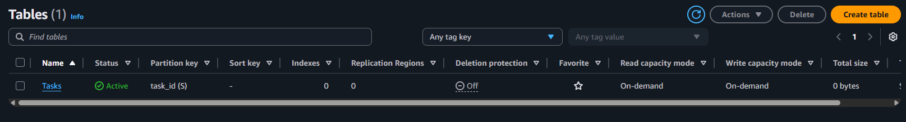
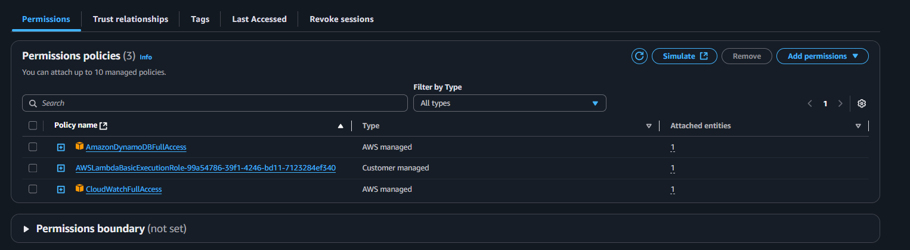
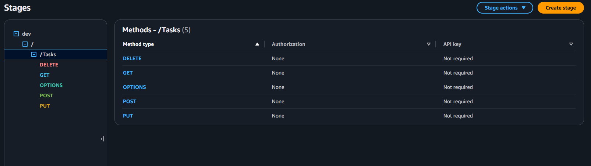
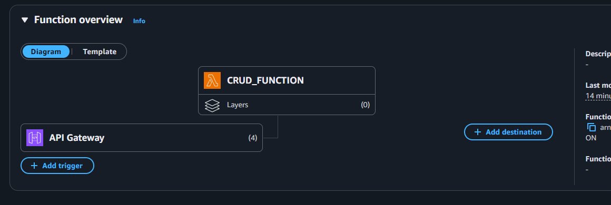
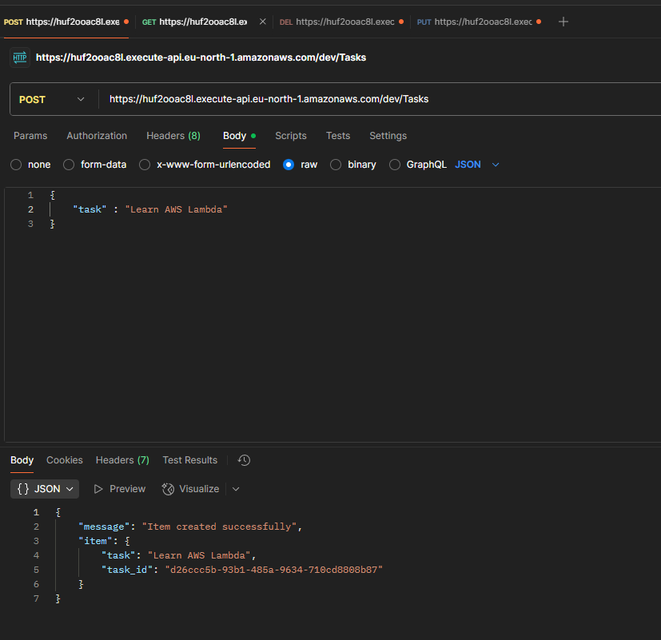
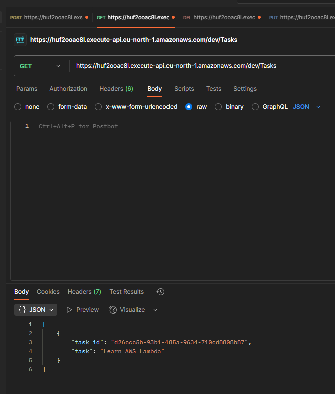
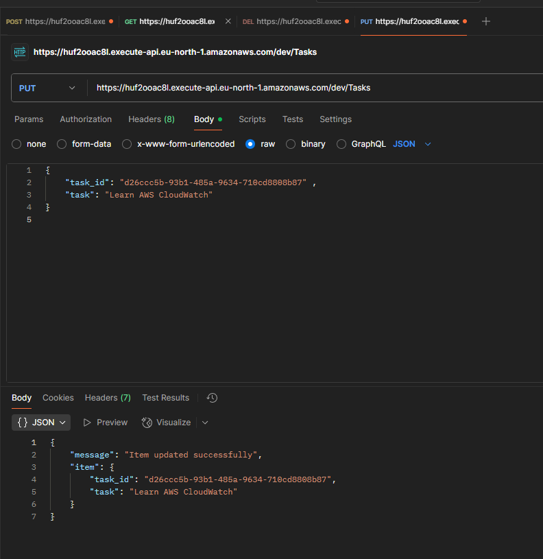
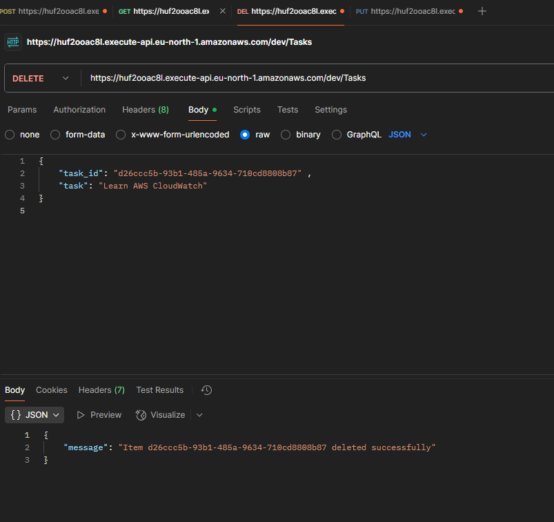
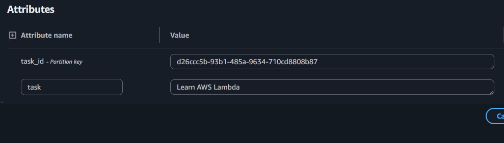
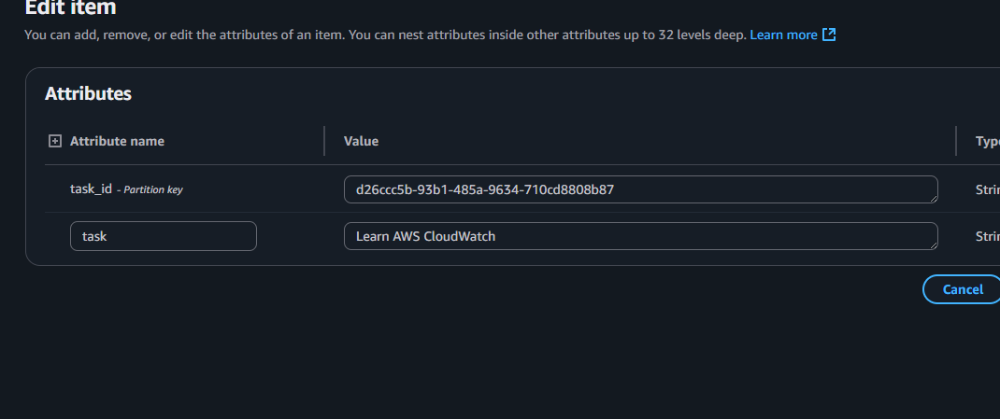

## **1️⃣ Project Overview**

This project is a **serverless CRUD API** built with **AWS Lambda, API Gateway, and DynamoDB**.  
It allows you to create, list, update (PATCH), and delete tasks.

---

## 🚀 Architecture

- **API Gateway** → exposes REST API endpoints
- **AWS Lambda** → executes CRUD operations
- **IAM Premissions** → allow lambda function full access for dynamodb and cloudwatch 
- **DynamoDB** → stores tasks (`task_id` is the primary key)
- **CloudWatch Logs** → monitors Lambda executions

---

## **1️⃣ Deployment Steps**

### **Step 1: DynamoDB Setup**
1. Create a DynamoDB table named **`Tasks`**.  
2. Set **Primary Key** = `task_id` (String).  
3. Table will store items like:  task .
4. . 

### **Step 2: Lambda Function**
1. Create a Lambda function (Python 3.x). 
2. Add the CRUD code (lambda_function.py).  
3. Attach an IAM role with DynamoDB + CloudWatch permissions.  

### **Step 3: API Gateway Setup**
1. Create a REST API in API Gateway. 
2. Add endpoints:
  - POST /create → Create task
  - GET /list → List tasks
  - PATCH /update → Update task
  - DELETE /delete → Delete task  
3. Integrate each endpoint with the Lambda function.  
4. Deploy API → Get public Invoke URL.
5. 

---

## **2️⃣ Lambda function with api**

---

## **3️⃣ Testing with Postman**
1. . 
2. .  
3. .
4. .  

--- 

## **4️⃣ DynamoDB Validation**
1. . 
2. .  

---

## **5️⃣  Monitoring**
1. CloudWatch Logs → See Lambda execution logs.

---