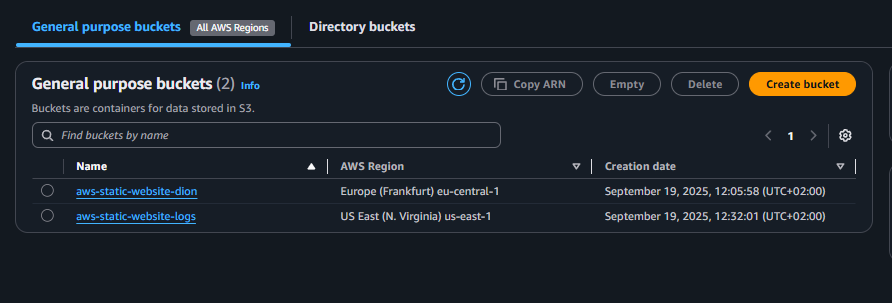

## **1️⃣ Project Overview**
This project demonstrates hosting a simple **static website** using AWS.  
Visitors can access the website globally via **CloudFront** over **HTTPS**.  

**Website features:**  
- HTML/CSS/JS frontend  
- Interactive greeting via JavaScript  
- Fully hosted on AWS S3 + CloudFront  
- Access monitoring through CloudFront logs  

---

## **2️⃣ File Structure**
aws-static-website/
│── index.html # Main webpage
│── style.css # Styles and layout
└── script.js # JavaScript interactivity

---
## **3️⃣ Deployment Steps**

### **Step 1: S3 Bucket (Testing Phase)**
1. Create a bucket with a unique name (e.g., `aws-static-website-dion`).  
2. Enable **Static Website Hosting** (index.html as default).  
3. Upload your files (`index.html`, `style.css`, `script.js`).  
4. **Testing permissions:**  
   - Temporarily **disable Block Public Access**.  
   - Add a **bucket policy** to allow public read access for testing:

```json
{
    "Version": "2012-10-17",
    "Statement": [
        {
            "Sid": "PublicReadGetObject",
            "Effect": "Allow",
            "Principal": "*",
            "Action": "s3:GetObject",
            "Resource": "arn:aws:s3:::YOUR_BUCKET_NAME/*"
        }
    ]
}
```
5. Open the S3 website URL to verify your site works correctly.





---


### **Step 2: CloudFront Distribution**
1. Create a **CloudFront web distribution**.  
2. Use the **S3 website endpoint** as the origin
3. Enable **Redirect HTTP to HTTPS**.  
4. Access your website using the CloudFront URL:  


---

### **Step 3: Logging & Monitoring**
- **CloudFront Access Logs:** stored in S3 for monitoring requests.  

---